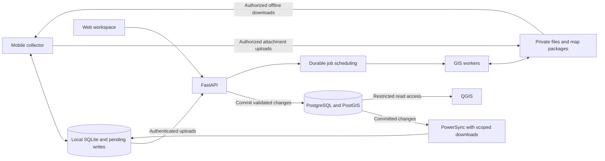

**Production architecture recommendation for FieldMaps**

Research date: September 17, 2026. Status: proposed architecture, ready for review and a device proof of concept. This report does not claim that synchronization, hosting, or QGIS integration has been implemented or tested.

**Recommendation**

Build a TypeScript React Native/Expo mobile collector and a TypeScript Next.js web workspace, backed by Python/FastAPI and PostgreSQL/PostGIS. Use native SQLite for offline records, evaluate PowerSync as the synchronization engine, and use MapLibre for map rendering. Start with managed infrastructure and one primary data region; introduce additional regions when customer requirements justify them.

This recommendation assumes a small team launching a service for multiple organizations, beginning with university research pilots. Team size, budget, device fleet, contractual data regions, and peak workload remain unconfirmed. These can change hosting and service tiers; the core application architecture should remain useful.

The confirmed requirements are our own custom app, offline collection, automatic synchronization, and QGIS interoperability. QField is a reference for experiments, not a replacement production app. The earlier [feasibility assessment](./QGIS-Field-Collection-Feasibility.md) contains the workbook analysis and detailed GIS findings.

**Products to build**

| Product surface                                                      | Who uses it and what it does                                                                                                                              | Priority                                                          |
| -------------------------------------------------------------------- | --------------------------------------------------------------------------------------------------------------------------------------------------------- | ----------------------------------------------------------------- |
| Mobile collector for Android and iOS, with deliberate tablet layouts | Download assignments and maps; place observations manually or with optional GPS; complete conditional forms; save and synchronize work                    | First release                                                     |
| Web project workspace                                                | Manage organizations, projects, sites and layers; select Janet’s variables; preview and publish forms; assign observers; review observations; export data | First release                                                     |
| Research and analysis workspace within the same web app              | Filter maps by time, site, round, and variable; show completeness and summaries; download coded analysis tables                                           | Basic analysis first; advanced analysis later                     |
| Internal support area within the same web app                        | Diagnose stalled synchronization, failed jobs, access problems, and version mismatches; audit privileged actions                                          | Minimal version before external pilots                            |
| GIS integration and developer interface                              | Read-only QGIS layers, GeoPackage/GeoJSON/CSV exports; later documented partner APIs and an optional QGIS publishing plugin                               | Basic QGIS integration first; plugin and partner automation later |

A public site, help center, and onboarding pages can live alongside the web product. A separate desktop application is not needed initially. Keep the web manager usable on tablets, but make the native collector the primary field tool. Separate interfaces can share form definitions, calculations, translations, and API contracts without forcing a desktop map editor into a phone layout.

**Recommended technologies**

| Responsibility                | Selection                                                                                          | Reason and boundary                                                                                                |
| ----------------------------- | -------------------------------------------------------------------------------------------------- | ------------------------------------------------------------------------------------------------------------------ |
| Mobile language and framework | TypeScript, React Native, Expo development builds, Expo Router                                     | Reuses React skills while allowing native maps, storage, files, and device integration                             |
| Web language and framework    | TypeScript, React, Next.js App Router                                                              | Continues the existing prototype’s framework; suitable for project management and analysis                         |
| Maps                          | MapLibre React Native and MapLibre GL JS                                                           | Related rendering ecosystems across native and web; map content and editing tools remain separate responsibilities |
| Device data                   | SQLite through PowerSync’s supported native adapter, initially OP-SQLite                           | Durable local records and a managed change queue; prove compatibility on target devices                            |
| Synchronization               | PowerSync Cloud as the first candidate                                                             | Reduces replication work; our backend still owns accepted writes, authorization, and conflicts                     |
| API and domain logic          | Python, FastAPI, Pydantic                                                                          | Fits GIS import/export processing and provides explicit validated API contracts                                    |
| Central data                  | PostgreSQL with PostGIS; SQLAlchemy, GeoAlchemy2, Alembic for access and migrations                | Relational project data, spatial queries, transactions, and GIS interoperability                                   |
| Large files                   | Private object storage, initially Supabase Storage                                                 | Photos, imagery, exports, and downloadable map packages belong outside observation rows                            |
| GIS processing                | Containerized Python workers with GDAL; add Rasterio, Shapely, and pyproj as needed                | Convert approved input formats, transform coordinates, validate geometry, and produce exports                      |
| Long-running jobs             | Celery with a managed Redis-compatible broker when map packaging/export jobs arrive                | Separate slow processing from record synchronization; persist job intent and status in Postgres                    |
| Contracts and form rules      | OpenAPI-generated TypeScript clients; versioned JSON form definitions and a restricted rule format | Keep web/mobile/server behavior aligned without duplicating handwritten API types                                  |
| Delivery and verification     | GitHub Actions, Expo EAS, pytest, Playwright, and native device acceptance tests                   | Exercise the full offline-to-server-to-QGIS path, including upgrades and failures                                  |

Use a small shared TypeScript package for form evaluation, stable codes, and generated client types. The Python server must independently validate answers and permission rules. Share rule fixtures across languages to verify equivalent results. React state and server-query caches can help the UI, but neither replaces the durable observation database.

FastAPI documents OpenAPI, JSON Schema, and automatic client-generation support. That is a practical interoperability benefit for a Python backend with TypeScript clients. [FastAPI features](https://fastapi.tiangolo.com/features/)

MapLibre’s Expo integration requires a native build; it does not run inside Expo Go. Pin a tested combination of Expo, React Native, MapLibre, PowerSync, and the SQLite adapter instead of independently selecting every latest release. [MapLibre Expo setup](https://maplibre.org/maplibre-react-native/docs/setup/expo/)

**How the system connects**

The database is authoritative for accepted shared records. The device is authoritative for work it has saved locally but has not yet uploaded. Those records must remain recoverable through network and authentication failures.

QGIS reads the same accepted data that the app writes. Refreshing its connected layer reveals committed observations. Start with restricted read-only database roles for trusted research staff; customer-facing GIS access may need an authenticated service instead of database credentials. Never distribute administrator credentials or expose unfiltered cross-organization views. QGIS explicitly supports PostgreSQL connections. [QGIS data sources](https://docs.qgis.org/3.44/en/docs/user_manual/managing_data_source/opening_data.html)

Arbitrary QGIS desktop edits would bypass application validation. Treat those as a separate later workflow with a controlled write contract. Likewise, displaying a QGIS project’s data does not automatically reproduce its styles and expression-based forms in MapLibre. Prepare supported map layers and translate the required forms explicitly. Add QGIS Server only if publishing QGIS-rendered maps or GIS services becomes a requirement.

**Offline design: three things must be downloaded and saved separately**

| Offline component     | Required behavior                                                                                                                              |
| --------------------- | ---------------------------------------------------------------------------------------------------------------------------------------------- |
| Maps and site assets  | Download a bounded area, required zoom levels, styles, fonts, imagery, and site geometry; validate completeness before showing “Ready offline” |
| Project configuration | Keep a versioned local copy of assignments, variables, choices, rules, zone definitions, and round context                                     |
| Collected work        | Save observations and pending changes transactionally; retain local photos and attachment status; recover after app and device restarts        |

MapLibre exposes offline region management, but this does not synchronize application records. The map supplier must separately permit the intended offline use. Evaluate MapTiler as a supplier and retain a path for institution-owned imagery. Its documented native offline packs establish capability in its SDK; they do not establish a blanket license or automatic interoperability with our selected React Native implementation. Verify the actual provider, plan, format, and integration. [MapLibre OfflineManager](https://maplibre.org/maplibre-react-native/docs/modules/offline-manager/), [MapTiler offline packs](https://docs.maptiler.com/mobile-sdk/ios/examples/offline-get-started/)

Store client geometry in a supported serialized representation and keep real PostGIS geometry on the server. PowerSync documents PostGIS conversion functions including `ST_AsGeoJSON`; that makes a projection feasible, but it does not supply all of PostGIS inside mobile SQLite. Validate geometry round trips, coordinate order, precision, and source CRS with known map locations. [PowerSync supported SQL](https://docs.powersync.com/sync/supported-sql)

PowerSync’s native adapter is important: its Expo Go SQL.js path is described as alpha and has weaker persistence characteristics. Use the native adapter in development builds and production; do not maintain an unrelated second SQLite queue for the same synchronized records. [PowerSync Expo Go support](https://docs.powersync.com/client-sdks/frameworks/expo-go-support)

The proposed write protocol is:

1. Allocate a stable observation ID on the device. Save its answers, geometry, form version, and pending operation atomically before confirming a local save.
2. On startup, resume, and regained connectivity, submit pending operations to FastAPI. Check organization/project authorization, immutable form version, geometry, and allowed state transitions.
3. Commit accepted writes and their duplicate-detection records in the same server transaction. Acknowledge only after that commit; duplicate delivery must not create another observation.
4. Deliver accepted changes back through scoped synchronization. Use revisions to detect conflicting edits; preserve rejected drafts and conflicting values for review instead of silently overwriting them.
5. Upload attachments separately with retry and integrity checks. Distinguish “record synchronized” from “all attachments synchronized,” and display unresolved failures clearly.

PowerSync requires the upload endpoint to complete database writes before reporting success. A worker queue is appropriate for map generation and exports, not for deferring an observation write that has already been acknowledged. [Writing client changes](https://docs.powersync.com/handling-writes/writing-client-changes)

Default conflict behavior is not sufficient for every research workflow. Independent observation creation is straightforward; concurrent changes to the same record need an explicit revision policy. A versioned JSON answer object must not be assumed to merge its individual answers automatically. Permanent validation failures need a durable rejected-work record and queue progress; temporary failures retry. [PowerSync conflict handling](https://docs.powersync.com/handling-writes/handling-update-conflicts)

Data-download permissions and upload permissions are separate controls. PowerSync’s streams control downloaded data; they do not authorize uploads. Mirror organization and project membership in stream rules, validate writes in the API, and use database row-level protections under correctly scoped roles. A privileged backend connection does not automatically inherit the signed-in user’s policies. [PowerSync RLS and streams](https://docs.powersync.com/integrations/supabase/rls-and-sync-streams)

Automatic synchronization is reliable as a foreground/resume behavior we can design and test. Closed-app execution is best effort: iOS and Android decide when background work runs, and user termination can prevent it until the app is reopened. The product must show pending work and provide a manual retry as a fallback. [Expo background tasks](https://docs.expo.dev/versions/latest/sdk/background-task/)

**Janet’s variable library is a core product capability**

Make project configuration a first-class feature rather than hardcoding this first spreadsheet into screens. Store reusable variable definitions, stable option codes, and immutable published form versions. Each observation records which form version it used. A later wording or visibility-rule change must not reinterpret historical data.

Represent display rules in a restricted, testable format with explicit dependencies and supported operators. JSON Schema can describe answer structure; conditional visibility and carry-forward behavior require additional application rules. Do not execute arbitrary code supplied by project managers.

Keep project, observer, round/zone context, and individual observations separate. Snapshot or version inherited context so changing weather or zone configuration does not rewrite previous events. Preserve two independent play-type/subtype slots, and distinguish unanswered, no, and not applicable.

Use normalized tables for identities, memberships, assignments, form versions, rounds, observations, and attachments. Versioned JSONB can hold flexible answers; publish typed analysis views and stable export columns for QGIS. The existing workbook issues must be resolved before generating the final codebook. PostGIS supplies spatial types and indexing within the same relational database. [Supabase PostGIS documentation](https://supabase.com/docs/guides/database/extensions/postgis)

**Hosting and commercial products**

My default for the assumed small team is the following managed arrangement. It is a deployment recommendation, not a claim that the services have already been integrated.

| Service                       | Initial choice                                                                                       | Adoption condition                                                                                                  |
| ----------------------------- | ---------------------------------------------------------------------------------------------------- | ------------------------------------------------------------------------------------------------------------------- |
| Web deployment                | Vercel                                                                                               | Fits the existing Next.js application and preview workflow                                                          |
| API and GIS workers           | Render paid container services                                                                       | Choose a location close to the database; verify GIS image size, memory, job duration, networking, and support needs |
| Database, identity, and files | Supabase managed PostgreSQL/PostGIS, Auth, and private Storage                                       | Use suitable paid capacity, explicit access policies, tested backups, and contractual region selection              |
| Device synchronization        | PowerSync Cloud                                                                                      | Adopt after the offline, security, migration, locality, and cost proof of concept passes                            |
| Supporting services           | Expo EAS for mobile delivery; MapTiler evaluated for maps; Sentry plus OpenTelemetry for diagnostics | Check current plans, data handling, and target-device compatibility before purchase                                 |

Vercel documents Next.js support. Render offers separate background workers and horizontal scaling; this makes it a reasonable operational fit for containerized GIS work. This is a preference for our workload, not a claim that Vercel cannot run Python APIs. [Next.js on Vercel](https://vercel.com/docs/frameworks/full-stack/nextjs), [Render workers](https://render.com/docs/background-workers), [Render scaling](https://render.com/docs/scaling)

This arrangement trades several vendor integrations for less infrastructure maintenance. Keep core data in ordinary Postgres, the API/workers in portable containers, and identity mapping explicit. Supabase-specific identity/storage policies and PowerSync configuration still create migration work; portability is not zero-cost switching.

If a launch customer already requires private networking, a particular country, or stronger availability commitments than this arrangement provides, consider AWS RDS PostgreSQL/PostGIS, ECS Fargate, and S3 from the start. Keep the application stack. RDS supports PostGIS and Fargate runs managed containers. Do not schedule a migration merely because the product reaches its second year. [RDS PostGIS](https://docs.aws.amazon.com/AmazonRDS/latest/UserGuide/Appendix.PostgreSQL.CommonDBATasks.PostGIS.html), [ECS Fargate](https://docs.aws.amazon.com/AmazonECS/latest/developerguide/AWS_Fargate.html)

Map downloads, imagery storage and delivery, synchronization traffic, database capacity/backups, and GIS processing are the main cost variables to measure. A credible monthly estimate needs expected organizations, active devices, observations, map sizes, retention, and geographic distribution. Free tiers are not the production operating plan.

**Global operation over the next 12–24 months**

Start with globally distributable apps, a CDN for suitable static content, and one primary region for the first customer group. Give organizations an explicit data-region setting in the model, even if only one region is available initially. Keep API, database, sync infrastructure, and private files geographically aligned where possible.

Supabase projects have a primary region; read replicas are asynchronous and read-only. They are not a substitute for a multi-region write architecture, and they do not automatically relocate Auth and Storage. [Supabase regions](https://supabase.com/docs/guides/platform/regions), [Supabase read replicas](https://supabase.com/docs/guides/platform/read-replicas)

When real demand requires regional isolation, create regional deployments with a home region per organization and controlled routing. Include synchronization copies, file storage, backups, identity data, logs, and support access in residency decisions. More deployment regions do not by themselves establish regulatory compliance. Do not promise immediate worldwide failover without testing replication, consistency, and recovery.

Keep backend functionality in a modular monolith: identity/access, projects/forms, collection/sync, GIS processing, and reporting are distinct modules, with workers running separately. Scale API and workers independently, add spatial indexes and bounded queries, and partition or split services only after measured bottlenecks justify the extra operations.

Plan translation keys, Unicode text, explicit time zones, locale-specific display formats, coordinate systems, accessibility, and phone/tablet layouts now. Those are less disruptive to establish early than to retrofit after many projects exist.

The following are proposed engineering acceptance targets, not measured capacity or vendor guarantees:

| Area                           | Initial target to validate                                                                                                                                                               |
| ------------------------------ | ---------------------------------------------------------------------------------------------------------------------------------------------------------------------------------------- |
| Offline durability             | A committed local observation survives app termination, reboot, temporary authentication failure, and failed synchronization; device loss before upload remains outside cloud recovery   |
| Representative device workload | Exercise 10,000 local observations, a 500 MB map package, and 30 days of offline project use; replace these assumptions with pilot measurements                                          |
| Reconnection and correctness   | Test 100 devices reconnecting together, repeated delivery, stale revisions, partial attachments, and schema upgrades without duplicate accepted observations or lost drafts              |
| Service reliability            | Establish and fund an initial 99.9% availability objective, server-record recovery point of at most 5 minutes, and recovery time of at most 4 hours; prove the actual recovery procedure |
| Isolation and operability      | No cross-organization downloads or writes; observe pending-work age, failed uploads, sync lag, rejected revisions, GIS job failures, and old-client versions                             |

Back up both data and files and perform restores. Supabase’s database backups do not contain Storage objects, so a database restore alone is incomplete recovery. [Supabase database backups](https://supabase.com/docs/guides/platform/backups)

Use per-account local data separation, device-keystore-protected secrets, appropriate local encryption, and a defined offline access period. A disconnected device cannot immediately learn that an account was revoked. Preserve unsent work safely through logout/account changes without showing it to the next user. Keep observations and sensitive form values out of routine diagnostic logs.

**What current industry evidence actually supports**

GitHub’s Octoverse 2025 reported TypeScript becoming its leading language by monthly contributors in August 2025. That is evidence of ecosystem activity, not proof that every product should use TypeScript. It supports our frontend choice alongside the existing React codebase. [GitHub Octoverse 2025](https://github.blog/news-insights/octoverse/octoverse-a-new-developer-joins-github-every-second-as-ai-leads-typescript-to-1/)

The latest published Stack Overflow survey located in this research was 2025. Its narrative reports Python adoption rising seven percentage points and FastAPI five points from the prior year, with PostgreSQL remaining the most desired and admired database. These observations support ecosystem durability; the primary reasons for our selections are GIS capability, reliable transactions, and team delivery. They are not 2026 adoption statistics. [Stack Overflow 2025 technology survey](https://survey.stackoverflow.co/2025/technology)

Local databases with server synchronization are a relevant architectural option, now offered by tools such as PowerSync and Electric. They are not interchangeable. Electric’s current documentation describes a read-path sync engine and leaves the write path to the application. For this mobile collection workflow, PowerSync is the first candidate because it provides a native SQLite SDK and client upload queue, while still requiring our server-side write design. [PowerSync React Native SDK](https://docs.powersync.com/client-sdks/reference/react-native-and-expo), [Electric write-path documentation](https://electric.ax/docs/sync/guides/writes)

AI-assisted coding can help implementation, but no AI feature is required to save an observation or evaluate a form. Introduce optional assistance such as variable-library import or report drafting later, with review and explicit data handling. Core offline collection must remain deterministic and work without an AI service.

**Decision records and alternatives**

All five decisions below are proposed. Their acceptance depends on review and the proof of concept, not on this document being written.

| Decision                                               | Context and selection                                                                                            | Alternatives considered                                                  | Consequence and reconsideration trigger                                                                                                                  |
| ------------------------------------------------------ | ---------------------------------------------------------------------------------------------------------------- | ------------------------------------------------------------------------ | -------------------------------------------------------------------------------------------------------------------------------------------------------- |
| ADR-001: Native collector plus web manager             | Offline files, durable capture, tablet usability, and desktop project setup favor Expo/React Native plus Next.js | PWA-only, Flutter, separate Swift/Kotlin apps                            | Two interfaces, shared contracts/rules. Reconsider runtime if device/GIS requirements demand a different native SDK                                      |
| ADR-002: FastAPI modular backend                       | GIS transformations, exports, and a public typed API favor Python/FastAPI                                        | All-TypeScript NestJS/Fastify; Django; early microservices               | Two application languages and deliberate cross-language contracts. All-TypeScript becomes attractive if Python/GIS work is minimal or team skills change |
| ADR-003: Postgres/PostGIS authority                    | Observations relate to tenants, forms, rounds, and geometry                                                      | Document-first storage or an ArcGIS feature service as primary authority | Strong GIS/relational fit; flexible answers need typed analysis views. Reconsider only for concrete external platform requirements                       |
| ADR-004: Managed sync candidate                        | Offline replication has substantial correctness and maintenance costs                                            | Custom SQLite outbox/cursor protocol; Electric with custom writes        | PowerSync reduces transport work but adds vendor cost and security configuration. Adopt only after lifecycle, PostGIS, conflict, and tenancy tests pass  |
| ADR-005: Managed hosting, one primary region initially | Small-team delivery and unknown demand favor managed services                                                    | AWS-first regional infrastructure; active-active global writes           | Faster operations with provider constraints. Choose AWS earlier for actual networking/residency/availability requirements; add regions by demand         |

ArcGIS SDKs can support a custom app with offline geodatabases and synchronization to ArcGIS feature services. Consider that path if customers specifically require their ArcGIS infrastructure and the supported SDK/language and commercial terms fit. It changes the data architecture; it is not automatically an easier route to our shared PostGIS design. [ArcGIS offline synchronization](https://developers.arcgis.com/kotlin/api-reference/arcgis-maps-kotlin/com.arcgismaps.tasks.offlinemaptask/-offline-map-sync-task/index.html)

A custom SQLite synchronization protocol is the fallback if PowerSync fails the gate. It must include an outbox, idempotent writes, ordered download cursors, deletions, conflict handling, secure account isolation, migrations, and recovery tooling. That fallback is an engineering commitment, not a weekend substitute.

**Delivery sequence and the next concrete proof**

1. Prove the riskiest path on an actual iPad and Android tablet: import one site, download its map, collect Janet’s test variables offline, restart, reconnect, and verify accepted records in PostGIS and a refreshed QGIS layer.
2. Build the pilot product: a constrained project/form builder, assignments, clear save/sync states, read-only GIS access, and coded exports. Finalize ambiguous workbook rules with Janet.
3. Harden for multiple organizations: access isolation, version compatibility, conflict review, diagnostics, real backup restores, load tests, staged releases, and support procedures.
4. Expand based on adoption: richer analysis, partner APIs, university sign-in, larger imagery workflows, and regional deployments where required.
5. Review readiness against evidence: real-device field sessions, reliable recovery, security boundaries, operational ownership, and measured costs. A 12–24 month production ambition is reasonable as a planning horizon, but staffing and scope must determine delivery commitments.

The first proof must also test an expired login, an app upgrade with pending writes, a permanently rejected record, two devices editing one record, a missing offline map asset, and an account switch. Passing a happy-path upload or a simulator test is insufficient to select the full production combination.

This repository has a Next.js/React/Leaflet prototype, now located in `web/`. Preserve useful management UI and domain ideas, then introduce the backend and collector incrementally. This architecture report originally changed documentation only; it does not connect FieldMaps to the separate Audit Tools backend or merge the products. See [workspace operations](Workspace.md) and [Supabase setup](Supabase-Setup.md) for subsequent implementation status.
