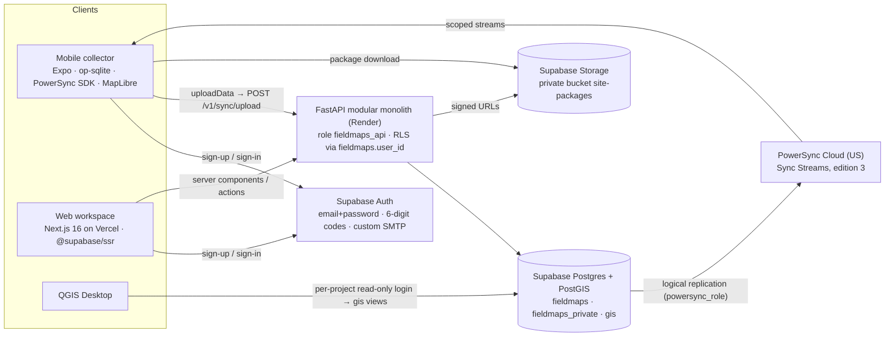

# Architecture: target system, layering, security rules

This file is part of the [FieldMaps production plan](README.md) and defines no tasks. It describes the shape that every task builds toward. When a task and this file disagree, stop and ask; do not quietly pick one.

## Current state (verified 2026-09-22)

**Mobile collector**
- Built on Expo SDK 57, RN 0.86 and expo-sqlite, with a custom append-only upload queue.
- The only auth call is `signInWithPassword` (`mobile/app/account.tsx:43`).
- The project ID is hard-coded (`mobile/connection.config.json:6`), and so is the API URL, `127.0.0.1`.
- Packages, sites and forms are bundled fixtures (`mobile/src/packages/bundled.ts`, `mobile/src/forms/registry.ts:10`).

**Web**
- Built on Next.js 16.2 and React 19, with no auth.
- Every workspace screen reads `web/src/data/*` fixtures.
- The package upload posts a fixture project ID (`web/src/data/project.ts:19`), so it gets a 422.

**API**
- FastAPI with 8 routes (`backend/src/fieldmaps_api/main.py`).
- Verifies Supabase ES256 JWTs through JWKS.
- Runs as the restricted role `fieldmaps_api`, under RLS keyed on the transaction-local GUC `fieldmaps.user_id`.
- Package preparation is real (`packages.py`, `qgis_project.py`).

**Database**
- Supabase Postgres 17 with PostGIS in `extensions`, project `lezmqhuucfwqknspgcdy`.
- The private schemas `fieldmaps`, `fieldmaps_meta` and `gis` are revoked from `anon` and `authenticated`.
- Hosted migrations stop before `0004_site_packages`; DB-01 fixes this.

**QGIS**
- A fixed-filter view, `gis.sample_observations`, read by one training login (`qgis/README.md`).

## Target system

## Security rules

1. **Every write goes through FastAPI.** Neither client writes to Postgres or Storage directly, except for uploading to a Storage URL the API has signed.
2. **The Data API stays closed for FieldMaps schemas.** `fieldmaps`, `fieldmaps_private` and `gis` are never exposed or granted to `anon`, `authenticated` or `service_role`. DB-04 adds default-privilege revokes and a test.
3. **There are two read paths, each with its own boundary:**
   - Web reads go through FastAPI, where RLS on `fieldmaps_api` applies.
   - Mobile reads go through PowerSync. PowerSync replicates with `BYPASSRLS`, so the **stream definitions are the security boundary**. They live in the repository (SYNC-02) and are tested by QA-02.
4. **The API asserts at startup that its role cannot bypass RLS** (`NOT rolbypassrls`, BE-02). The API's role checks join memberships without their own `user_id` filter and rely on RLS for it (`backend/src/fieldmaps_api/queries.py:8,18-21`).
5. **SECURITY DEFINER functions:**
   - They live only in `fieldmaps_private`.
   - Each has `search_path = ''` and `EXECUTE` granted only to `fieldmaps_api` (or to `supabase_auth_admin` for Auth hooks).
   - Each checks `fieldmaps.request_user_id()`.
   - Nothing uses SECURITY DEFINER just to get past a permission error.
6. **No authorization data in `user_metadata`.** Users can edit it. Authorization data never comes from JWT claims beyond `sub`, `iss`, `aud` and `exp`. Tokens with `is_anonymous` are rejected (BE-05).
7. **Files never go into synced rows.**
   - Package archives move from `bytea` to Storage (DB-12, BE-13), because PowerSync caps a row at 15 MB and archives can reach 16 MiB.
   - Rows carry metadata and the sha256.
8. **Secrets are injected at runtime only.** This covers the Render Secret Files and the Supabase secret key used for account deletion (BE-08). The publishable key and URLs are public config.

## Environments

| Environment | Supabase | PowerSync | API | Web | Mobile |
|---|---|---|---|---|---|
| local | `supabase start` (Mailpit, `auth` schema, PostGIS) from DB-02 | none, or a self-hosted container, optional | `uv run` or Docker against local Supabase | `pnpm dev` | dev build with `APP_ENV=development` |
| staging | the current project `lezmqhuucfwqknspgcdy` | Cloud Free (OPS-08) | Render staging (OPS-04) | Vercel preview | EAS `preview` |
| production | a new project, Pro (OPS-09) | Cloud Pro | Render production | Vercel production | EAS `production` |

Each environment gets its own PowerSync instance and replication slot. Never point two PowerSync instances at one Supabase project; slots are limited (see [sync-powersync.md](sync-powersync.md#source-database)).

## Layering inside each component

| Component | Layers, top to bottom | Rule |
|---|---|---|
| Mobile (`mobile/`) | `app/` routes (thin) → `src/features/*` (screens, hooks) → `src/domain` (form engine, record builder; pure) → `src/data` (PowerSync schema and queries, API client, file store) → `src/platform` (auth storage, NetInfo, location) | UI never runs SQL directly; `src/domain` has no I/O and keeps its unit tests |
| Web (`web/`) | `src/app/` route groups → `src/features/*` → `src/lib/api` (generated types plus a server-only fetch wrapper) → `src/lib/supabase` (SSR clients) | Tenant data is fetched on the server; client components receive props or call Server Actions |
| API (`backend/`) | `routers/<module>.py` → `services/<module>.py` → `repositories/<module>.py` (SQL constants in `queries`) → the database | Services raise domain errors; one handler maps them to the error envelope ([contracts.md](contracts.md#error-envelope)); repositories never raise `HTTPException` |
| Database (`supabase/`) | `fieldmaps` (tables with RLS) · `fieldmaps_private` (SECURITY DEFINER helpers) · `gis` (generated read views) · `fieldmaps_meta` (ledger) | Every table has RLS enabled; `supabase/migrations/` is the only migration source after DB-02/DB-03 |

## API modules (modular monolith)

| Module | Owns | Tasks |
|---|---|---|
| `identity` | me, profile, account deletion | BE-06, BE-08 |
| `tenancy` | organizations, projects, members, invitations | BE-07 |
| `sites` | sites, zones, packages, Storage | BE-13 |
| `instrument` | forms, versions, publish, retire | BE-10, BE-11 |
| `collection` | sync upload, rejections, the legacy PUT | BE-12 |
| `analysis` | observation queries, summary, exports | BE-14 |
| `gis` | reader grants (pilot); OGC API Features later | BE-15, GIS-06 |

## Fixture inventory

This is every piece of dummy data that must be gone before the pilot, and the task that removes each one. When a row's task is done, its screen reads real data.

| Where | Fixture today | Replaced by | Task |
|---|---|---|---|
| `mobile/connection.config.json` | Localhost API, fixed `projectId` | `config/<APP_ENV>.json`; the project comes from `/v1/me` | MOB-01, MOB-04 |
| `mobile/src/packages/bundled.ts`, `mobile/src/maps/sample-site.ts` | 4 studies (2 fake), a hand-drawn site | Synced `site_packages` and downloaded archives; the Training package goes through the real pipeline | MOB-14, BE-13 |
| `mobile/src/forms/fixtures/*`, `mobile/src/forms/registry.ts:10` | Bundled `shell-v1` and `janet-test-v1` | Synced published `form_versions`; the fixtures become `contracts/forms/*.json` test data | MOB-13, CON-02 |
| `mobile/src/domain/observation.ts:30`, `build-observation.ts:45-79` | `"sample-garden"` literal, branching on version strings, a Janet-specific summary key | The generic envelope; summary and carry-forward become definition properties | MOB-13 |
| `mobile/src/storage/sync-store.ts:29`, `mobile/src/sync/contracts.ts:25` | A queue and payload for `shell-v1` only | The PowerSync queue and the envelope | MOB-10 |
| Developer copy across `mobile/app/*` and `mobile/src/*/provider.tsx` | Explanations of stubs | Copy for field users | MOB-15 |
| `web/src/data/observations.ts` | 132 seeded records | `GET /v1/projects/{p}/observations` | WEB-10 |
| `web/src/data/project.ts` | Viewer fixed as Janet; fixture org, project and sites; illustrative QGIS values | The session, `/v1/me`, the sites API, `/gis-access` | WEB-06, WEB-08, WEB-12 |
| `web/src/data/basemaps.ts`, `web/src/components/basemaps/PackageUpload.tsx:92,166-181` | Fixture packages, a fixture project ID, a pasted token | The packages API, project from the route, token from the server session | WEB-01, WEB-08 |
| `web/src/data/instrument.ts` | Fixture variables, rules and versions | The forms and versions API | WEB-09 |
| `web/src/lib/analysis.ts` over the fixtures | Client-side aggregation | `GET …/summary` | WEB-11 |
| `database/sample-gis.sql`, hosted `gis.sample_observations` | A view with fixed IDs | Generated per-form views | GIS-01, GIS-03 |

## What is deliberately not in the architecture yet

- Background job workers. Celery and GDAL arrive only with GIS-07.
- Multi-region hosting.
- Billing.
- Closed-app background sync.
- Photo attachments.
- A visual form builder.

Each is post-pilot; see the backlog in the [README](README.md#cut-list-if-the-schedule-slips).
