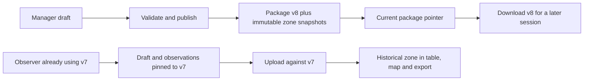

# Zone polygon boundaries: master implementation plan

Planning baseline: 2026-10-10. This is a proposed implementation contract, not a claim of shipped functionality. The user authorized this plan and its commit, not implementation, migrations, deployment or release. Finish this feature and its acceptance gates before starting other map features.

## Outcome and scope

A manager can draft, validate and publish named polygon zones for an existing site. Observers download an immutable map, collect offline against those exact boundaries, and upload later even if a newer map has been published. Managers can filter maps, tables and exports by the zone recorded at collection, without silently reinterpreting earlier research.

The first delivery edits zones over an existing site's imported ground/reference layers. It does not add imagery ingestion, basemap configuration, round scheduling, new form types, observation correction, live collaboration or a new sync engine. A site without a usable ground boundary needs a package import first. This deliberately bounds the feature while retaining the existing QGIS import route.

## Read order and ownership

| Document | Authority |
| --- | --- |
| This master plan | Product invariants, decisions, scope, coordination and release order |
| [Current architecture assessment](assessment.md) | Source-backed baseline, gaps and reuse decisions |
| [API and shared contract](contract.md) | Proposed wire shapes, errors, compatibility and geometry semantics |
| [Database plan](../../../supabase/ZONE-BOUNDARIES.md) | Storage, constraints, RLS, publication transaction, migration |
| [Backend plan](../../../backend/ZONE-BOUNDARIES.md) | Services, routes, validation, queries and rollout |
| [Mobile data plan](../../../mobile/ZONE-BOUNDARIES.md) | Offline persistence, package/session ownership and upload behavior |
| [Web handoff](../../../web/ZONE-BOUNDARIES.md) | Required behavior and integration boundaries; Claude owns detailed UI design |
| [GIS plan](../../../qgis/ZONE-BOUNDARIES.md) | Historical geometry, typed exports and read-only analysis |
| [Verification and edge cases](verification.md) | Release-blocking scenarios and evidence requirements |
| [Claude prompt](claude-prompt.md) | Copyable assignment for web and mobile frontend planning |

Task status lives only in the existing owning `PLAN.md` files, or the contract/verification task files. These feature documents contain specifications, not duplicate progress boards. The [production index](../README.md) links the tasks into its dependency graph. Phase numbers preserve that graph's sequencing; they are not new calendar promises.

## Non-negotiable behavior

1. **History is immutable.** An observation references a specific published package and a zone within it. Changing a boundary or label creates a new package; old geometry, labels, records and receipts remain unchanged.
2. **Offline work survives.** Publication never swaps the map under an active observer. Session/draft/queued-record dependencies retain old packages. An expired login pauses uploads, not local preservation. Revoked access does not authorize upload or erase device data.
3. **Spatial support is explicit.** Standard/Reliability are point observations. Inventory describes a whole zone; its stored compatibility anchor is not an observed event location. No feature infers a child's location from the observer's GPS.
4. **Authorization and validity are server-enforced.** Manager editing, tenant/site/package membership, geometry validity, version conflicts and observation attribution cannot depend on UI checks.
5. **No invented history.** Existing uploads without package evidence remain legacy/unversioned. Do not assign today's boundaries, infer a version from timestamps, or mutate queued request bodies to make them look newer.

## Main design decisions

### Reuse map packages as boundary versions

Use the existing immutable `site_packages` version as the zone-set revision. Add stable zone identities and immutable per-package zone snapshots. Do not introduce an independently published zone-set version in this feature: a single package pins ground, forms, boundaries and labels together. A label-only change also creates a new package. Duplicating small vector geometry per package is acceptable; object-storage migration and tile deduplication are separate tasks.

### Identity, labels and boundary edits

A zone has a stable UUID scoped to its site, an immutable human code, and a version-specific label and geometry. Ordinary reshaping/renaming retains the UUID. Removing a zone means omitting it from the next package, never deleting historical snapshots. Splitting or merging creates new identities; do not equate the children with the original. Codes are never reused for a different zone identity. Cross-version aggregation may group an explicitly retained identity, but must still expose map version because the sampled area changed.

The current code's `zoneId` is a string code, not a UUID. New contracts use distinct names; do not reinterpret that field in place. Importers must preserve supplied known UUIDs or require manager identity mapping. Similar labels/codes alone do not prove historical identity.

### Geometry and point assignment

Accept Polygon and MultiPolygon with holes. Store a normalized PostGIS MultiPolygon in EPSG:4326; publish full-precision GeoJSON from that geometry. Bounding boxes are for navigation only. New editor publications reject interior overlaps, self-intersections, empty geometry and zones extending outside the site's actual ground boundary. Adjacent shared edges are allowed; site gaps are allowed and reported. No arbitrary overlap tolerance or automatic repair may silently change the research boundary.

For point observations, the chosen zone must cover the point in the pinned package. A point on a shared edge can be assigned to either touching zone explicitly chosen by the observer; never select the first polygon by iteration order. A point in a gap or hole has no valid zone for this feature's collection flow. Preserve the unfinished observation and ask for placement/zone correction before save. The server repeats this validation. [Exact semantics and limits](contract.md#geometry-contract).

### Historical versus current-boundary analysis

Default all filters and labels to **recorded zone at collection**. Filtering an identity across versions is allowed but clearly labelled; filtering a package narrows to one boundary version. Add `map_version` and recorded zone identity/label to detail and export. There is already a zone field and web zone filter; this is a correction and extension, not an entirely new column from scratch.

"Points inside today's boundaries" is a different analysis and is deferred. Do not silently spatially reclassify older records, including unversioned legacy rows. If added later, require an explicit target package, independent derived fields and a visible analysis basis. Whole-zone inventories cannot be reclassified from their anchor points.

### Update and conflict policy

| Situation | Required result |
| --- | --- |
| Manager edits while observer is offline | Draft changes are invisible to collection; publication creates a new version |
| Manager publishes while observer has an active session | Current session/drafts/queued uploads retain their original package |
| Observer reconnects after days | Authorized upload against retained historical package succeeds; no age cutoff |
| New package download fails | Last verified installed package remains usable; no partial activation |
| Two managers edit or publish | ETag/revision preconditions; first valid commit wins, second receives actionable conflict |
| Old publication request retries after a newer publication | Return its original result; never reactivate its old package |
| Zone removed or renamed | Old records retain old snapshot; existing offline sessions remain valid |
| Access revoked | Server refuses new writes, device retains records for authorized recovery |

## Architecture judgment

The stack is capable: PostgreSQL/PostGIS, FastAPI service/repository boundaries, generated OpenAPI types, immutable packages, SQLite outbox and receipt verification are a suitable foundation. It is not yet complete enough to call this feature safe or claim universal industry compliance. Required repairs include historical binding, geometry parity at edges, durable version selection, atomic package installation, package-reference retention, account-scoped async work and server-side filtered reads.

Do not replace the outbox with PowerSync, add Redux/TanStack Query, adopt ArcGIS services, or introduce a worker platform merely to implement polygons. The existing D27 outbox decision remains in force. Improvements must remove a demonstrated failure mode; frontend architecture choices belong to Claude within these contracts.

## Execution ownership and dependency waves

| Wave | Owning tasks | Exit condition |
| --- | --- | --- |
| A: freeze contracts | CON-05 | Shared examples, geometry decisions, compatibility and error policy reviewed |
| B: durable foundation | DB-15, then DB-16; MOB-28 may start after A independently | Transaction/RLS/migration tests; local version retention and queue compatibility |
| C: services | BE-18, then BE-19; BE-20 after observation schema | Draft publication, bound uploads and complete filtered read surfaces |
| D: clients and GIS | MOB-29, WEB-28, WEB-29, GIS-09 | Real APIs wired; Claude's UI plan and browser/device scenarios exercised |
| E: integrated acceptance | QA-07 | Cross-layer scenarios, migration rehearsal and evidence reviewed |

Owners and tasks live in [supabase](../../../supabase/PLAN.md), [backend](../../../backend/PLAN.md), [mobile](../../../mobile/PLAN.md), [web](../../../web/PLAN.md), [QGIS](../../../qgis/PLAN.md), [contracts](../contracts.md) and [verification](../verification.md). Estimates on individual tasks are engineering days including local checks, not elapsed parallel completion promises. Integration/device work can expose additional work; split any task exceeding five days rather than hiding it.

The dependency graph gates implementation/integration, not read-only preparation: Claude can plan UI now from this proposal, and refine it once CON-05 freezes. API/query owners can inspect and design ahead of their schema prerequisites. Do not implement a competing wire contract or mark dependent acceptance complete before prerequisites land.

### Parallel-agent operating agreement

The lead freezes CON-05 before parallel writers consume interfaces. Use disjoint ownership: DB agent owns migrations/SQL fixtures; API agent owns Python/schema; mobile data agent owns storage/domain/sync/packages; web agent owns web; GIS agent owns QGIS docs/view specifications. **The DB agent alone writes migrations, including GIS views.** The contract coordinator alone regenerates OpenAPI and both generated TypeScript files after schema integration. Claude's mobile UI agent and the mobile data agent explicitly allocate shared `session/provider.tsx`, package providers and API client edits before working.

Agents receive their bounded task text, product intent, invariants, file ownership, dependencies and test obligations. They also read this master plan and their component specification. They are not alone in the checkout: preserve unrelated edits, do not revert others' work, and report conflicts to the lead. Parallelize independent work or read-only reviews; serialize overlapping writes, migrations and integration. Current user authorization is for the planning commit only, not later implementation commits or branches.

Agents may improve algorithms, file organization and tests within the agreed behavior. A changed field, error, compatibility rule, retention policy or geometry meaning requires a short proposed deviation sent to the lead with evidence, alternatives, affected consumers and revised acceptance cases. The lead updates the canonical contract before dependent work continues. Ask the human only for unresolved product policy, destructive operations or external authorization; avoid asking about routine implementation choices. Never work around a failing invariant just to satisfy a checklist.

Each implementation handoff includes changed paths, contract effects, tests actually run, remaining uncertainty and `DONE`, `DONE_WITH_CONCERNS`, `NEEDS_CONTEXT` or `BLOCKED`. Perform a spec-compliance review followed by a code-quality review; resolve findings before the next dependent task. Do not report a failed/usage-limited reviewer as approval.

## Delivery and rollout

1. Add schema and compatibility support with publication disabled. Rehearse additive migrations on a disposable local database restored from synthetic old-shape fixtures; keep old API/retry behavior unchanged.
2. Deploy backend capability and historical read support only after explicit deployment approval. Release mobile version pinning and safe v2 uploads; Claude wires the web against the frozen contracts.
3. Enable editor publication per site only after backend, mobile and web acceptance. Unsupported old clients may continue v1 collection/upload, visibly unversioned; managers must understand these records cannot gain exact historical attribution retroactively.
4. On a publication defect, disable new publication and issue a corrected package with a higher version. Retain old schema/read/upload support and all published artifacts. Do not roll back by deleting versions or rewriting collected data.
5. Complete QA-07, including a real offline device and QGIS/readback scenario, before calling zone boundaries complete or moving to the next map feature.

## Product defaults needing explicit visibility

The recommendations above intentionally choose non-overlapping observation zones, required zone assignment for new bound records, edits over existing ground, and delayed adoption until a new session. These are proposed defaults, not claims that the research lead approved them. Implementation can begin with contract work; if the study requires overlapping zones, zone-free point capture, or mandatory immediate updates, the lead must revise CON-05 before dependent implementation. Never silently change those policies.

## Evidence boundary

This plan was created from local source, existing documentation and official technical references. No hosted database, deployment, observer device or runtime was modified or reverified for this planning task. Some older READMEs and roadmap context describe future work as if it were current; [the assessment](assessment.md) records those discrepancies. Plan validation proves links/dependencies, not feature behavior.
